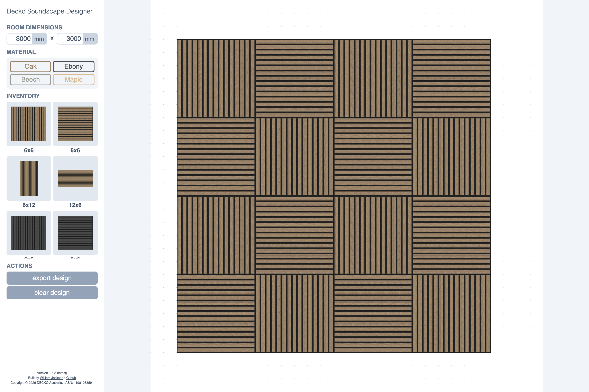

# DECKO Soundscape Designer

A visual acoustic-panel designer I built in high school for DECKO. Set wall dimensions, arrange panels, then export the layout with panel and box quantities.

[](docs/media/designer.png)

[View the exported design](docs/media/export.png)

## Try it locally

```sh
python3 -m http.server 8000
```

Open [localhost:8000](http://localhost:8000). Drag panels onto the wall, then select **export design**.
